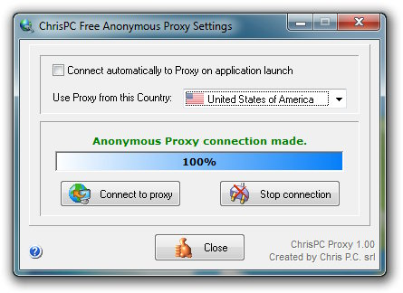
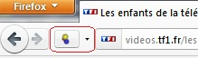

À plusieurs reprises, je voulais regarder mes emissions préférées depuis l'étranger. J'en ai essayé plusieurs méthodes qui se sont avérées plus ou moins fonctionnelles. Récément, en lisant un article dans le magazine *(réf à fournir plus tard)*

[Chris Pc Free ](http://www.chris-pc.com/proxy/index.html) se trouve être la solution à mes détresses de téléphage. Facile à installer ! 

Une fois le logiciel lancé, il suffit de choisir France (bien sûr, un autre pays si vous voulez regarder d'autres chaînes de d'autres pays), et de cliquer sur connect.

Bien sûr, si votre connexion se trouve être d'un lenteur visible, à savoir des coupures à chaque 2 secondes. Je vous conseille de télécharger
la vidéo et de la regarder à l'aise une fois terminé. Pour cela plusieurs alternatives, soit des logiciels comme Internet Download Manager et cie, ou des pluggins qui s'ajoutent à vos browser.

 
De mon côté, je me sert de l'extension de firefox, [downloadhelper.](http://www.downloadhelper.net/) Je trouve cette extension d'une facilité à pouvoir me télécharger toutes les videos de n'importe quel site.