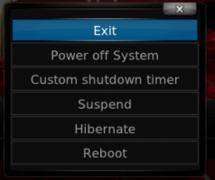

*The solution below is specific to the [DNS323 NAS](http://www.dlink.com/us/en/support/product/dns-323-sharecenter-2-bay-network-storage-enclosure), but can be modified to handle your NAS if it gets a standard web interface where you get the option to shutdown.*

I always wanted to shutdown my nas from XBMC without going through the web interface.  First, I started by looking for some prexisting solution with no sucess. So, I decided to create one. 

On my Quest to find a solution, I managed to stumble over a batch script on this website : [http://forums.dlink.com/index.php?topic=8362.0](http://forums.dlink.com/index.php?topic=8362.0). 

It was easy to convert it to python. 
    
    import urllib,urllib2 , re
    
    NAME="admin"
	PASSWD="pass"
	IP="192.168.2.13"

	Base_URL = "http://"+ IP + "/goform/formLogin?f_login_type=0&f_LOGIN_NAME="+ NAME +"&f_LOGIN_PASSWD="+ PASSWD
	shutdown_URL = "http://"+ IP + "/goform/sysShutDown?shootdown"

	#Login screen
	WebSock = urllib.urlopen(Base_URL)
	WebHTML = WebSock.read()

	#shutdown screen
	WebSock = urllib.urlopen(shutdown_URL)
	WebHTML = WebSock.read()

	WebSock.close()

*Warning : You have to be logged out from the DNS323 web interface or this script will fail to execute, as some gently guy post it!*

You can run it, to test for its success *(Replace username, password and ip of your nas where needed)*

Next, head to XBMC to add a menu entry. Modify the Confluene skin (the one that comes with Eden v11.0) to run the script created above, and add an entry to the Exit MENU.

 

The dialog can be found in the file : **DialogButtonMenu.xml** in this folder: 'C:\Program Files\XBMC\addons\skin.confluence\720p  (If you a get a standard installation)

	<control type="button" id="15">				
		<description>Shutdown NAS button</description>
		<width>340</width>
		<height>40</height>
		<textcolor>grey2</textcolor>
		<focusedcolor>white</focusedcolor>
		<align>center</align>
		<textwidth>290</textwidth>
		<texturefocus border="25,5,25,5">ShutdownButtonFocus.png</texturefocus>
		<texturenofocus border="25,5,25,5">ShutdownButtonNoFocus.png</texturenofocus>
		<onclick>XBMC.runscript(special://home/shutdown.py)</onclick>			
		<pulseonselect>no</pulseonselect>				
		font13				
		<label>Shutdwon NAS</label>				
		<visible>yes</visible>			
	</control>

Remember that **special://home** = C:\Documents and Settings\[username]\Application Data\XBMC\ on Windows XP. 
You can read more about special folder on the [official wiki](http://wiki.xbmc.org/index.php?title=Special_protocol)

Put the Script in the special folder, and you're done !

*If you have installed another skin, you should look for where to modify.*